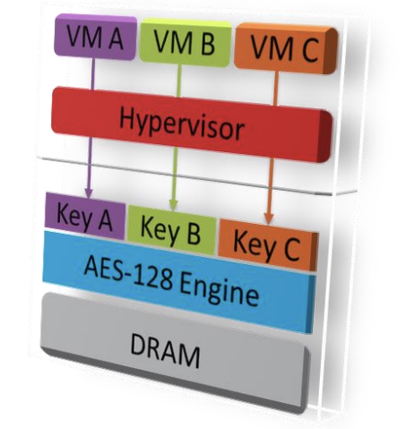

## Confidential Compute on AMD

Confidential computing helps keep data private while it’s in use. In the past, data remained undefended while it was being processed virtually or in the cloud. Confidential computing on AMD EPYC™ processors can be enabled using built-in security features like Secure Encrypted Virtualization (SEV), Secure Memory Encryption (SME) which helps protect data in use.

AMD's memory encryption technologies that are designed to address these needs across a variety of systems and can be broadly divided into several categories

**Secure Memory Encryption (SME)**

- defines a simple and efficient architectural capability for main memory encryption.
- SME is a general purpose mechanism that is flexible, integrated into the CPU architecture.
- Scalable from embedded to high-end server workloads, and requires no application software modifications.

**Secure Encrypted Virtualization (SEV)**

- Integrates main memory encryption capabilities with the existing AMD-V virtualization architecture to support encrypted virtual machines.
- Encrypting virtual machines can help protect them not only from physical threats but also from other virtual machines or even the hypervisor itself.
- SEV represents security paradigm to cloud computing where virtual machines need not fully trust the hypervisor and host system.
- As with SME, no application software modifications are required to support SEV.

**AMD Secure Encrypted Virtualization-Encrypted State (SEV-ES)**

- Encrypts all CPU register contents when a VM stops running.
- Prevents the leakage of information in CPU registers to components like the hypervisor.
- It can even detect malicious modifications to a CPU register state.

**AMD Secure Encrypted Virtualization-Secure Nested Paging (SEV-SNP)**

- Adds strong memory integrity protection to help prevent malicious hypervisor-based attacks like data replay, memory re-mapping.
- Also, SEV-SNP introduces several additional optional security enhancements designed to support additional VM use models,
- It offers stronger protection around interrupt behavior, and offer increased protection against recently disclosed side channel attacks.

---

## SEV-SNP Memory Management

SEV-SNP allows a guest to separate its memory into shared and private memory. Shared memory is accessible to host software and is marked as hypervisor-owned in the Reverse Map Table (RMP), a data structure that stores the SEV-SNP security attributes of each page of memory in the system.

Private memory is assigned to the guest in the RMP, writeable only by the guest, and encrypted with the guest’s unique memory encryption keys. The guest uses private memory to store sensitive data and its executable code. The CPU and IOMMU both enforce the access control policy for guest private memory by checking the RMP as required during address translation to ensure that the software or device accessing memory has sufficient privileges.

This comes with limitations as the device can only operate within the shared memory space of the guest and cannot access the private memory of the guest. If the guest needs data to flow between its private memory and the assigned device, the guest must copy the data in and out of a shared buffer that is accessible by both the guest and assigned devices.

> Figure 1: Diagram depicting bounce buffering required for a non-trusted device (left) and direct access to private memory by a trusted device (right).

---

## SEV Security Model

Traditional computing systems have operated using a ring-based security model. In this model, high privilege code has full access to the resources at its level and of all lower privileged levels.

In the SEV model, code executing at different levels (namely hypervisor vs guest) is isolated so neither has access to the resources of the other. Even though the hypervisor level is traditionally “more privileged” than the guest level, SEV separates these levels through cryptographic isolation. Communication between hypervisor and guest is still possible, but those communication paths are tightly controlled.

Consequently, SEV technology is built around a threat model where an attacker is assumed to have access to not only execute user level privileged code on the target machine, but can potentially execute malware at the higher privileged hypervisor level as well. The attacker may also have physical access to the
machine including to the DRAM chips themselves.

In all these cases, SEV provides additional assurances to help protect the guest virtual machine code and data from the attacker. Note that SEV does not protect
against denial-of-service attacks against the guest.

> Figure 2: SEV Security Model

---

## SEV Architecture

SEV is an extension to the AMD-V architecture which supports running multiple VMs under the control of a hypervisor. When enabled, SEV hardware tags all code and data with its VM ASID which indicates which VM the data originated from or is intended for. This tag is kept with the data at all times when inside the SOC, and prevents that data from being used by anyone other than the owner.

While the tag protects VM data inside the SOC, AES with 128 bit encryption protects data outside the SOC. When data leaves or enters the SOC, it is encrypted/decrypted respectively by hardware with a key based on the associated tag.

Each VM as well as the hypervisor is associated with a tag, and consequently an associated encryption key. Because of the tag and memory encryption, data is restricted to only the VM using that tag. If that data is accessed by anyone else, including the hypervisor, they will only be able to see the data in its encrypted form. This provides strong cryptographic isolation between the VMs, as well as between the VMs and the hypervisor.

> Figure 3: SEV Architecture

## Memory Encryption

One of the key features of SEV is that guest VMs are able to choose which data memory pages they would like to be private. This choice is done using the standard CPU page tables, and is fully controlled by the guest. Private memory is encrypted with the guest-specific key, while shared memory may be encrypted with the hypervisor key.

This feature allows VMs to mark selected pages of memory data they want to keep confidential (private), and others to be used for communication with other VMs
or the hypervisor. In a typical arrangement, the guest would map all of its code and data as private, except for specific shared pages that it chooses to expose.

For security, SEV hardware does require certain types of memory (including instruction pages and page tables) to always be private to protect the VM. An example communication configuration is shown in Figure 4. In this example, the SEV-enabled guest and hypervisor communicate through memory that both entities mark as shared. All other guest memory is encrypted with
the guest’s key (which the HV cannot use).

> Figure 4: Guest/HV Communication Example

---

 
Related Posts

- [AMD MEMORY ENCRYPTION](https://www.amd.com/content/dam/amd/en/documents/epyc-business-docs/white-papers/memory-encryption-white-paper.pdf)
- [AMD SEV-TIO: Secure Encrypted Virtualization](https://www.amd.com/content/dam/amd/en/documents/developer/sev-tio-whitepaper.pdf)
- [AMD Secure Encrypted Virtualization (SEV)](https://www.amd.com/en/developer/sev.html)
