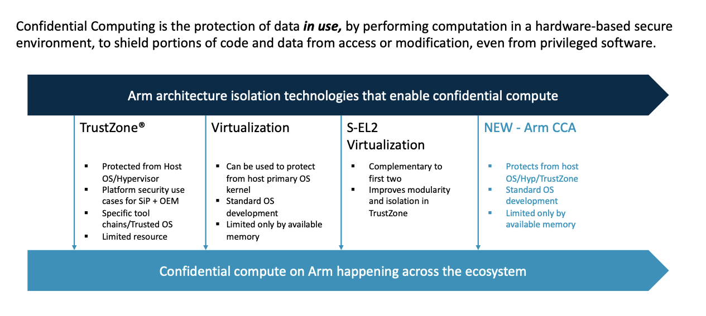
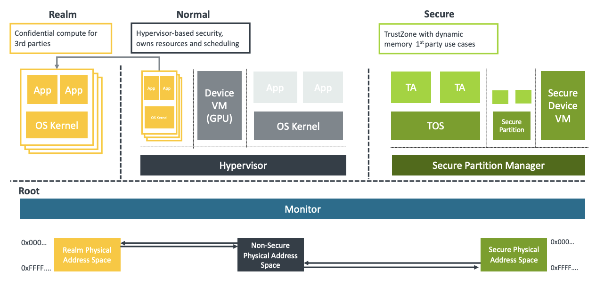
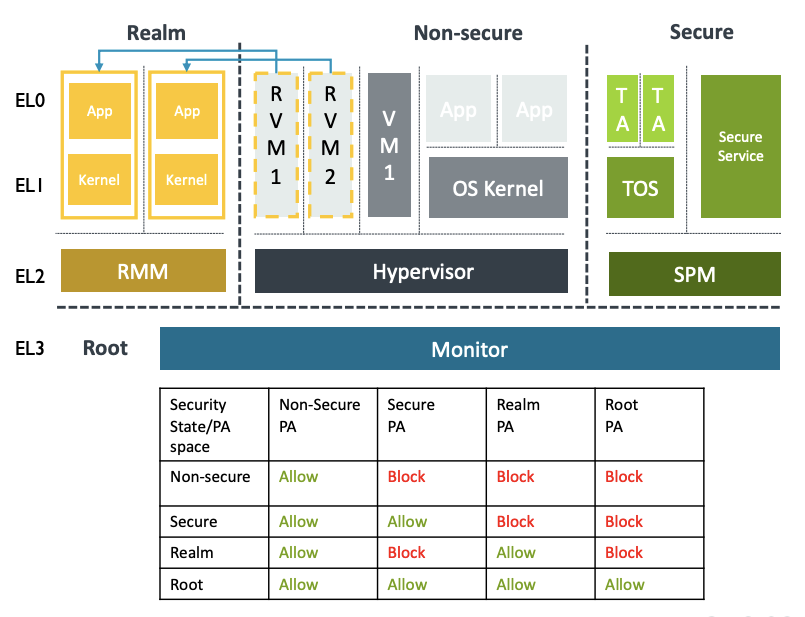
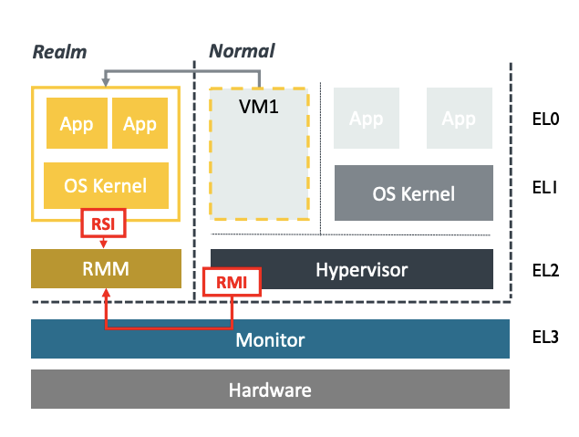

## Confidential Compute in Arm

Arm's Confidential Compute Architecture (CCA) leverages the groundwork established by Arm's TrustZone technology. Under the CCA framework, it's specifically engineered to safeguard application data, even when it's actively utilized. This level of protection extends to shielding private data from unauthorized access, even by privileged software components like the hypervisor or the operating system.

Confidential Compute Architecture is an integral part of the freshly introduced Armv9 architecture. More precisely, it serves as an optional feature within Armv9.2 and is poised to evolve into a mandatory extension in forthcoming specifications. To determine whether a CPU supports CCA, software developers can examine the presence of the Realm Management Extension (RME) feature.

> Figure 1: Confidential computing features on ARM chips

---

## Overview of Arm CCA

Previously, access to high-trust environments was primarily restricted to silicon vendors and OEMs, typically achieved through technologies like TrustZones. With the introduction of Arm CCA, the goal is to expand the availability of high-trust environments to all developers, with the aim of making it a standard for mainstream workloads. Initially, this will be implemented through OS-related software.

At the core of the Confidential Compute Architecture are "Realms," which function as small, self-contained high-trust environments or enclaves. The architecture is specifically engineered to safeguard private data throughout the entire technology stack, starting from the silicon level.

CCA offers robust protection for isolating workloads that inherently distrust each other, providing resilience against compromised rich operating systems such as Linux or Windows, fortifying defenses against compromised hypervisors, and introducing novel protection measures for applications operating within secure environments.

A significant aspect of CCA involves shielding realms from the underlying hypervisor. While the hypervisor retains responsibilities for resource allocation and tasks like scheduling, it is no longer granted access to the data contained within a realm.

The number of realms supported by a system is theoretically limitless, constrained only by the available system resources, such as memory and computational power. For instance, small IoT devices may have only a handful of realms, while a powerful server System on Chip (SoC) could handle hundreds of realms. The creation and termination of realms are designed to be efficient operations, suitable for use by applications as needed.

> Figure 2: ARM Confidential Computing features on Chip

---

## Arm CCA hardware architecture

Hardware that supports the confidential compute architecture will have the Realm Management Extension (RME) available. At its core, processors that implement the Realm Management Extension have two new hardware capabilities: the creation of realms and dynamic memory assignment.

With the new Realm Management Extension, pages can now transition from the non-secure world to the secure world and back again. This allows TrustZone to be utilized for much more memory-intensive applications.

Two new hardware features in the Realm Management Extension (RME)

**1. New isolation boundaries for 3rd party confidential computing**

- Realms: New type of protected execution environment
- Data and/or code are protected from any other execution environments:
  - Hypervisors
  - OS Kernels
  - Other Realms
  - Even TrustZone

**2. Dynamic assignment of memory to physical address spaces / worlds**

- Supports Realms AND adds dynamic memory support to TrustZone
  - Arm dynamic TrustZone technology
  - Removes boot-time static memory carve-outs

**RME adds another two security states and associated physical address spaces**

- Realm: A new mutually distrusting space for confidential compute
- Root: The Monitor gets its own private address space

HW isolation between address spaces is managed through a new Granule Protection Table (GPT), an extension of MMU page tables that is controlled by the Monitor in EL3

- Invalid accesses raise page faults

> Figure 3: ARM Confidential Computing Arch H/W stack

---

## CCA is a combination of hardware and firmware

As part of the Arm CCA, a new firmware/software architecture is also defined. A new Realm Management Monitor (RMM) is defined which provides services for the hypervisor as well as to the realms themselves. This is done via a new Realm Management Interface (RMI).

> Figure 4: Realm Management Interface (RMI)

Services for the hypervisor include the creation and destruction of realms as well as adding and removing memory. Additionally, realms can also request attestation reports via the RMI which can be for the platform or the realm which can be presented to a requesting party.

---

 
Related Posts

- [HASP-2021-Session2-Arm-CCA.pdf](https://haspworkshop.org/2021/slides/HASP-2021-Session2-Arm-CCA.pdf)
- [Arm-CCA-Extensions](https://developer.arm.com/documentation/den0125/0300/Arm-CCA-Extensions)
