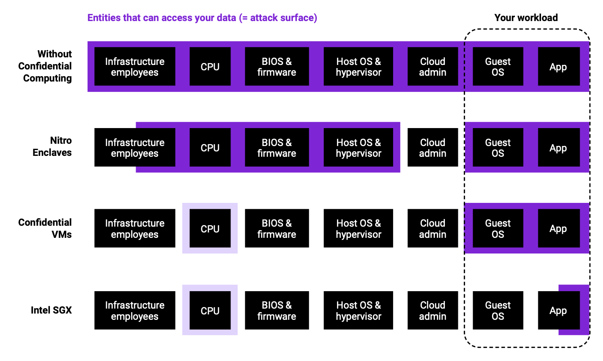
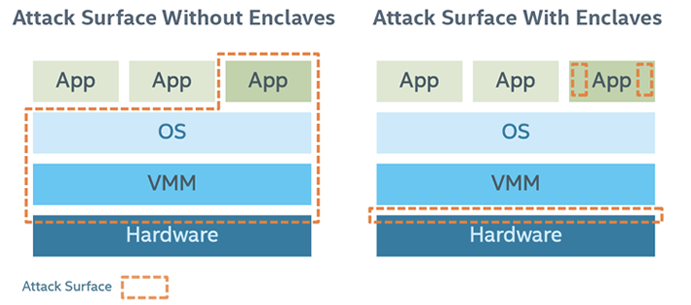
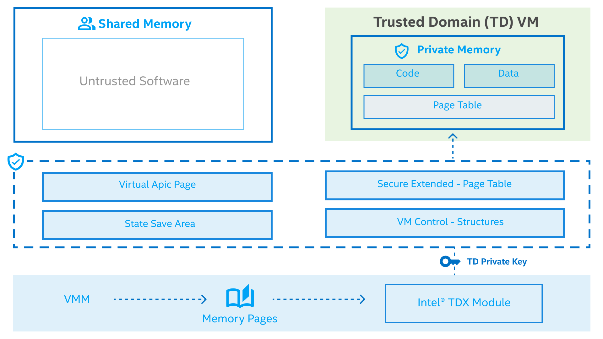

## What is Confidential Computing?

Data can exist in three states:

- Data in storage is `at rest`.
- Data traversing the network is `in transit`.
- Data being processed is `in use`.

**Encryption at rest**

- Prevents data from being obtained in an unencrypted form, in the event of an attack.
- Used in services such as Disk Encryption, SQL Databases, Storage Accounts, etc.

**Encryption in transit (E2E)**

- Prevents data from being sent in clear text over public or private networks.
- Typically happens via SSL and TLS protocols.

**Encryption in use**

- Protecting the data in use at processor/memory and caches.

Classical mechanisms to protect data in transit and at rest remain must-haves. These mechanisms are not enough when you are processing the very sensitive data. Even when you’re diligently keeping your environments up-to-date with all of the latest governance and security recommendations that Microsoft has on offer, protecting sensitive data while it is being processed might still be worth considering.

> 📖 From the docs: “The trusted computing base (TCB) refers to all of a system’s hardware, firmware, and software components that provide a secure environment. The components inside the TCB are considered “critical”. If one component inside the TCB is compromised, the entire system’s security may be jeopardized. A lower TCB means higher security.”

A **Trusted Execution Environment (TEE)**, such as an Enclave/TDX, is a tampering resistant environment that provides security assurances to us. The range of assurances often depends on what ships with the TEE, but at a minimum, we will often see the following types of security assurances:

**Data integrity**

- Prevents unauthorized entities from modifying data inside of an enclave.

**Code integrity**

- Prevents unauthorized entities from modifying code inside of an enclave.

**Data confidentiality**

- Prevents unauthorized entities from viewing data as it is being processed inside of an enclave.

> 💡 “Keep the attack surface small!” Hardware-based TEEs can remove the operating system, (cloud) platform and service providers, along with their administrators, from the list of parties that your company places trust in. Doing so can potentially reduce the risk of a security breach or compromise.

 

The more code that is put inside of the trusted execution environment, the more vulnerable your setup might become due to the larger trusted computing base. Again, code that is run inside of an enclave cannot be viewed by a host or hypervisor, so keeping the code-base that runs inside the TEE to a minimum will typically result in more confidentiality assurances.

> Figure 1: Simplified comparison of the trusted computing base (TCB) of the different confidential computing technologies. “Infra- structure employees” includes cloud provider and datacenter employees. For Intel SGX and CVMs, the CPU enforces the secure execution context. It is thus marked with lighter purple.

With Intel based Microprocessors you can have two different type trusted computing base (TCB) environments

- Intel® SGX
- Intel® TDX

---

## Intel Software Guard Extensions (SGX)

Intel® Software Guard Extensions (Intel® SGX) offers hardware-based memory encryption that isolates specific application code and data in memory. Intel® SGX allows user-level code to allocate private regions of memory, called enclaves, which are designed to be protected from processes running at higher privilege levels. Only Intel® SGX offers such a granular level of control and protection

Traditionally, when a system’s BIOS, hypervisor, or operating system is compromised by a malicious attack, the attacker’s code can gain visibility and access to everything higher in the system stack, such as applications and data. Intel SGX utilizes memory encryption and hardware-enforced access controls to change how data is accessed, providing enclaves of protected
memory in which to run applications and data.

Intel SGX (Software Guard Extension) is a new instruction set in Skylake Intel CPUs since autumn 2015. It provides a reverse sandbox that protects enclaves from:

- OS or hypervisor
- BIOS, firmware, drivers
- System management module (Ring 2)
- Intel management engine (ME)
- Any remote attack

In short, SGX architecture is a hardware-enforced security mechanism that requires **Trusted Computing Base (TCB), Hardware Secrets, Remote Attestation, Sealed Storage and Memory Encryption**.

In summary, Intel SGX offers the following protections from known hardware and software attacks:

- Enclave memory cannot be read or written from outside the enclave regardless of the current privilege level and CPU mode.
- Production enclaves cannot be debugged by software or hardware debuggers.
- The enclave environment cannot be entered through classic function calls, jumps, register manipulation, or stack manipulation. The only way to call an enclave function is through a new instruction that performs several protection checks.
- Enclave memory is encrypted using industry-standard encryption algorithms with replay protection. Tapping the memory or connecting the DRAM modules to another system will yield only encrypted data.
- The memory encryption key randomly changes every power cycle. The key is stored within the CPU and is not accessible.
- Data isolated within enclaves can only be accessed by code that shares the enclave.

As a result, the attack surface can be largely reduced after applying Intel SGX:

> Figure 2: Attack Surface

---

## Intel Trust Domain Extensions (TDX)

This hardware-based trusted execution environment (TEE) facilitates the deployment of trust domains (TD), which are hardware-isolated virtual machines (VM) designed to protect sensitive data and applications from unauthorized access.

A CPU-measured Intel TDX module enables Intel TDX. This software module runs in a new CPU Secure Arbitration Mode (SEAM) as a peer virtual machine manager (VMM), and supports TD entry and exit using the existing virtualization infrastructure. The module is hosted in a reserved memory space identified by the SEAM Range Register (SEAMRR).

Intel TDX uses hardware extensions for managing and encrypting memory and protects both the confidentiality and integrity of the TD CPU state from non-SEAM mode.

The main security goal of Intel® Trust Domain Extension (Intel® TDX) technology is to remove the need for a TDX guest to trust the host and virtual machine manager (VMM). It is important to note that this security objective is not unique to the TDX architecture, but it is common across all confidential cloud computing solutions (CCC) (such as TDX, AMD SEV, etc) and therefore many aspects described below will be applicable to other CCC technologies.

> Figure 3 shows the Trusted Computing Base (TCB) for the Linux TDX SW stack

 

**TDX Memory Protection** - TDX leverages VMX to enforce the memory isolation for TDs. Similar to legacy VMs, TDs are unable to access the memory of other security domains. As SMM, hypervisors, the TDX Module, and other VMs/TDs. With VMX, hypervisors maintain EPTs to enforce memory isolation.

Since hypervisors are no longer trusted, TDX has moved the task of memory management to the TDX Module, which controls the address translation of TD’s private memory.

---

 

**Related Posts**

- [azure-confidential-computing-iaas](https://thomasvanlaere.com/posts/2022/04/azure-confidential-computing-iaas/)
- [sgx-bootstrap/overview](https://sgx101.gitbook.io/sgx101/sgx-bootstrap/overview)
- [intel-confidential-computing](https://www.intel.com/content/www/us/en/security/confidential-computing.html)
