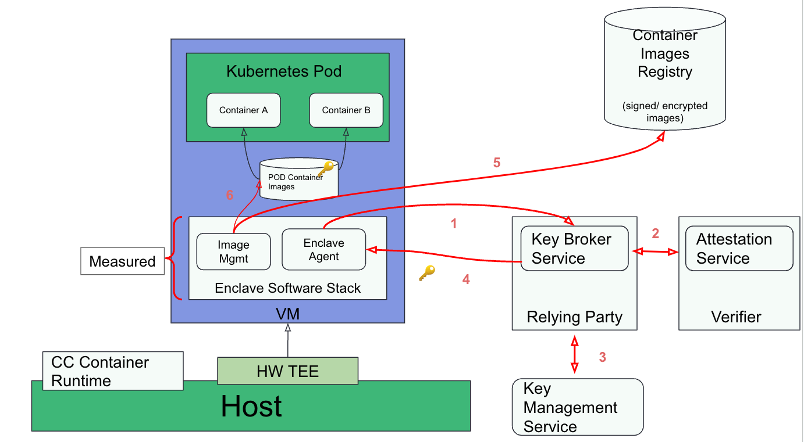
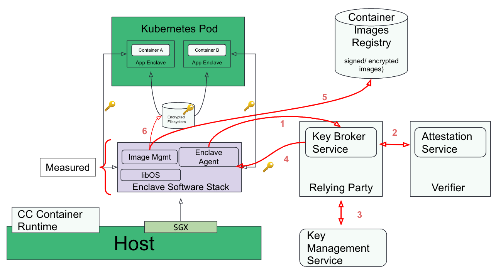

## What is Confidential Computing?

Data can exist in three states:

- Data in storage is `at rest`.
- Data traversing the network is `in transit`.
- Data being processed is `in use`.

**Encryption at rest**

- Prevents data from being obtained in an unencrypted form, in the event of an attack.
- Used in services such as Disk Encryption, SQL Databases, Storage Accounts, etc.

**Encryption in transit (E2E)**

- Prevents data from being sent in clear text over public or private networks.
- Typically happens via SSL and TLS protocols.

**Encryption in use**

- Protecting the data in use at processor/memory and caches.

## Key Components

The following diagram shows how the different building blocks for Confidential Computing (CC) come together:

### Infra layer

It can be on-premises (bare metal, VMware etc.) or public clouds (AWS, Azure, GCP, etc.)

Hardware with CC support - this includes 2 distinct models:

- <b>VM-based TEEs</b> - In this model, memory is encrypted along a traditional VM boundary running on top of a VMM. AMD SEV-SNP, Intel TDX, IBM Secure Execution and Protected Execution Functionality (PEF) are examples of VM-based TEEs.

- <b> Process-based TEEs </b> - In this model, a process that needs to run securely is divided into two components: trusted and untrusted. The trusted component resides in encrypted memory and handles confidential computing, while the untrusted component interfaces with the operating system and propagates I/O from encrypted memory to the rest of the system. Intel SGX is an example of a process-based TEE.

### Hypervisor

This includes hypervisors such as QEMU/KVM, cloud hypervisor, public cloud provider hypervisors etc.

### The Confidential Computing Services

This block contains a number of services (colored pink) which are required for creating a holistic CC platform which the customer can then use to build their solution. This currently includes the following services:

<b>Attestation service</b> - The primary purpose of the attestation service is to validate the evidence provided by the hardware TEE. This is the Verifier, as defined in the RATS architecture.

<b>Key Broker Service (KBS) </b> - The KBS is the Relying Party, as defined by the RATS architecture. Following are its primary functions:

- Receive evidence from the Attester (confidential VM or container) via a challenge-response protocol.
- Relay the evidence to the Attestation Service for verification.
- Apply appraisal policy for the returned Attestation Results to assess the trustworthiness of the Attester.
- Interact with the Key Management Service to retrieve the keys and then send them back to the Attester.

<b>Key management service </b> - A service for securely storing, managing and backing up of cryptographic keys used by applications and users.

<b> Image build service </b> - Services used to build confidential containers or VM images for end users.

<b>Image registry </b> - A service that is used to store encrypted and/or signed container and VM images required for CC workloads. Examples of such registries include Quay.io, Docker Hub, CSPs provided registries, etc.

---

## Confidential Container Stack

The two following sections describe a generic software architecture for Kubernetes pods to run in either VM-based or process-based TEEs.

Although internal implementations for the two approaches differ, they share the same goals and attributes:

- Remove cloud and infrastructure providers from the guest application Trusted Computing Base (TCB).
- Integrate natively with the Kubernetes control plane.
- Provide an unmodified Kubernetes user and developer experience.
- Deploy unmodified workloads.

### VM-based TEE

VM-based TEEs (e.g. AMD SEV, IBM SE or Intel TDX) can be used to build a confidential containers software architecture:

Following is the workflow when deploying a Kubernetes pod with VM-based TEEs:

CC workload preparation

- User builds the container image(s) (e.g. with tools like podman).
- User signs/encrypts the container image(s).
- User pushes the container image(s) to the image registry.

Deploying the CC workload in k8s

- User deploys the workload (kubectl apply -f cc_workload.yaml).
- Kubernetes schedules the workload to target host having the required capability to run confidential containers.

CC workload execution flow (red connector in the diagram)

- Confidential containers runtime on the host starts the VM TEE (The enclave).
- Enclave (agent) performs remote attestation: steps 1-2 in the diagram.
- Enclave (agent) gets the keys required to verify/decrypt the containers image(s): steps 3-4 in the diagram.
- Enclave (image management) downloads the container image(s) : step 5 in the diagram.
- Enclave verifies/decrypts the container image(s) : step 6 in the diagram.
- Enclave starts the container workload.

## 

### Process-based TEE

The confidential containers software architecture can also be built on top of process-based TEEs like e.g. Intel SGX:

Following is the workflow when deploying a Kubernetes pod with a process-based TEEs. The main differences from the VM-based TEE approach are the last 3 steps involving interaction between 2 enclave processes:

CC workload preparation

- User builds the container image(s) (e.g. with tools like podman).
- User signs/encrypts the container image(s).
- User pushes the container image(s) to the image registry.

Deploying the CC workload in k8s

- User deploys the workload (kubectl apply -f cc_workload.yaml).
- Kubernetes schedules the workload to target host having the required capability to run confidential containers.

CC workload execution flow (red connector in the diagram)

- Confidential containers runtime on the host starts the enclave agent.
- Enclave (agent) performs remote attestation: steps 1-2 in the diagram.
- Enclave (agent) gets the keys required to verify/decrypt the containers image(s): steps 3-4 in the diagram.
- Enclave (image management) downloads the container image(s) : step 5 in the diagram.
- Enclave verifies, decrypts and writes the container image(s) to a local encrypted filesystem: step 6 in the diagram.
- The runtime starts the app enclave which reads the container bundle from the encrypted filesystem.
- Secure use of the encrypted filesystem is facilitated by a key exchange between the agent and app enclaves using either sealing or local attestation.

## 

As can be seen, the flows for process and VM-based TEEs are almost identical. It should be noted that process-based TEE requires a few additional software components like libOS without which the application requires re-architecting. This is not the case for VM-based TEEs. Conversely, Process based TEEs do not require a separate VM and CC-aware hypervisor.

---

 

**Credits**

- [Confidential Containers](https://github.com/confidential-containers)
