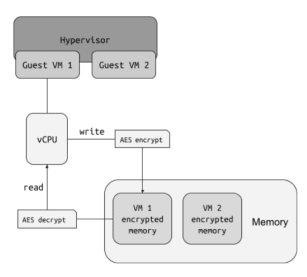
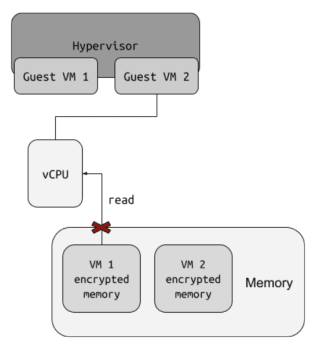
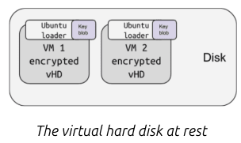
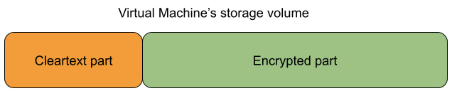
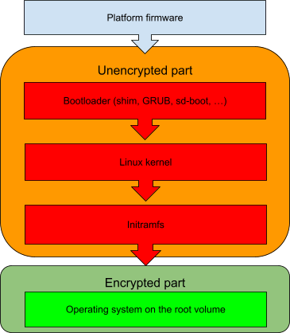

Confidential Computing enhances the security of public cloud platforms by adopting a nuanced approach rather than an all-or-nothing strategy. It minimizes the vulnerability of a cloud environment through the implementation of a defense-in-depth architecture.

This is accomplished by leveraging security technologies embedded in central processing units (CPUs), including the AMD SEV technology, Trusted Platform Modules (TPMs), and the built-in security features of operating systems like Ubuntu. Now, let's explore how these protective measures are implemented within the cloud environment using Ubuntu.

---

## Runtime VM Memory Encryption

Confidential VMs are powered by AMD's SEV technology, which encompasses SEV, SEV-ES, and SEV-SNP. These VMs operate within a secure environment, employing AES encryption to safeguard their memory and CPU registers. This robust encryption guarantees that neither other VMs nor the host administrator can access the data being processed. The operational concept can be visualized in the simplified diagram below.

While the CPU is in the guest VM mode, it consistently encrypts the memory locations it writes to and decrypts them when reading. Each VM is allocated specific memory areas, ensuring that in the event of a hypervisor breach, one VM cannot access the memory of another VM; it can only access an encrypted version of it.

This model empowers the creation of private VMs within the public cloud, making them suitable for handling sensitive workloads. However, it's important to note that this represents just one aspect of cloud security. While runtime memory encryption plays a vital role in this security framework, workloads running in the cloud are typically loaded from the cloud's infrastructure, often from a hard disk.

## VM Encryption at rest

Ubuntu's operating system takes care of safeguarding data while it's at rest. Through its robust full disk encryption capabilities, Ubuntu guarantees that all data written to the disk is encrypted and decrypted using AES. Additionally, it ensures the validation of each boot step through the UEFI secure boot process. The key necessary for disk encryption is securely stored within the virtual disk in an encrypted format.

The guest operating system is also responsible for providing greater security to the data at rest. As access to storage volumes is normally arbitrated by the host, the only feasible way for delivering confidentiality is encryption.

Opting for full disk encryption, rather than encrypting specific data volumes, appears to be an attractive approach. However, a key consideration arises: Is it feasible to encrypt every element comprehensively? Given that we cannot depend on the host to handle decryption on our behalf, it necessitates retaining some decryption code in an unencrypted form.

Key to decrypt the encrypted part of the storage volume must be automatically accessible to the genuine VM but to no one else. The most common way this is currently achieved is by using a virtual Trusted Platform Module (vTPM) backed by hardware.

While it doesn’t seem to be possible to hide it, the true requirement is to make sure the untrusted host cannot modify it unnoticed. To achieve that, code signing technologies like UEFI SecureBoot can be utilized. SecureBoot is a technology which guarantees that only the code trusted by the platform vendor is executed when the system boots, allowing it to prevent attacks on the system before the operating system is fully loaded.

## VM Encryption during boot time

With confidential disk encryption, the root volume of a VM is pre-encrypted prior to the first boot on the target host. Some parts of the volume must remain unencrypted. In particular, all the code required to obtain the key to the encrypted part of the volume and perform the decryption must remain as cleartext.

When the root volume of the operating system is encrypted, the decryption must happen in the initramfs; meaning that the bare minimum unencrypted volume must include all pieces of the boot chain up to the initramfs:

The key to the encrypted part needs to be revealed during the initramfs boot phase so the boot sequence can continue to the operating system. This also means that all the code running in the VM up to that point must be verified to prevent a possible attack from a compromised host trying to reveal the encryption key. For example, if the initramfs is not verified, then the host can try injecting some malicious code into it to steal the key.

The established standard for boot time code verification is UEFI SecureBoot, which guarantees that only code trusted by the platform vendor is executed when the system boots. Traditionally, SecureBoot scheme covers the following:

- First stage bootloader (shim)
- Second stage bootloader (GNU GRUB)
- Linux kernel

The vTPM operates within the Guest VM address space, so it is protected by the run-time memory encryption of the CPU, and is also encrypted at rest.

---

 
References

- [RHEL confidential virtual machines on Azure](https://www.redhat.com/en/blog/rhel-confidential-virtual-machines-azure-technical-deep-dive)
- [Ubuntu Pro Confidential Computing on Azure](https://ubuntu.com/blog/how-we-designed-ubuntu-pro-for-confidential-computing-on-azure)
