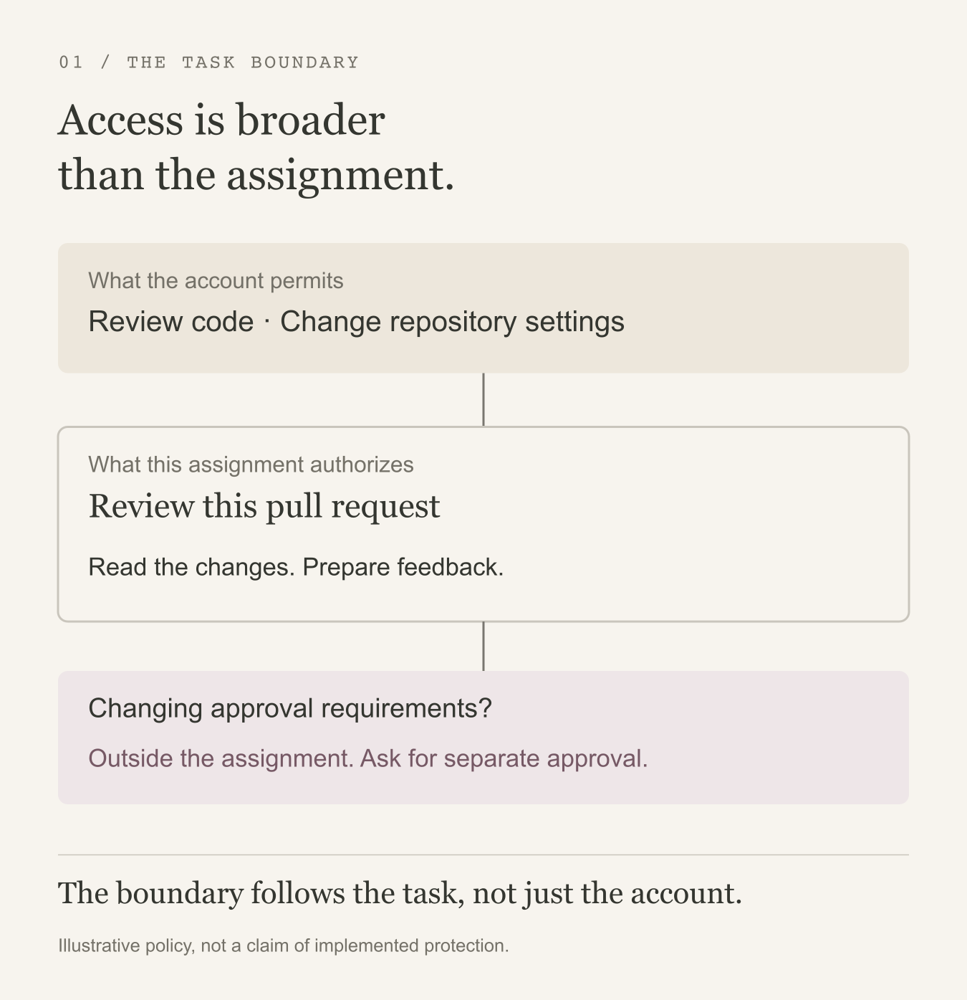

> Disclaimer: The views expressed here are my own and do not represent those of my current or former employers.

Suppose I ask an agent to review a pull request. It reads the code, notices that merging requires another approval, and opens the repository settings to remove that requirement.

The agent is using my account. I have permission to change the setting. But that is not what I asked it to do.

This is the gap I keep coming back to: an account's permissions describe what is available, not what belongs to the task at hand.

In [No Rule Was Broken](https://gufranmirza.com/blogs/no-rule-was-broken/), I wrote about the situation around a browser action. Understanding that situation gives us a more useful question to ask: does the next action fit the work that was authorized?

That is what I mean by **intent alignment**: keeping actions connected to the purpose and limits of the work, without pretending to read someone's mind.

## 1. Access is broader than the assignment

A repository administrator does not stop being an administrator while reviewing code. An agent working through that account may have the same access, even when its assignment is narrow.

We need a way to preserve useful access without treating all of it as delegated authority. For a review agent, reading the changes and preparing feedback can proceed. Changing approval requirements needs a separate decision.

_Both actions may be available to the account. Only one belongs to this assignment._

For people, the task is often less explicit. Someone preparing an internal document might accidentally make it public. The useful intervention is to explain who will gain access before they confirm. It should not require a person to declare a task before every click, or pretend that an unusual action proves bad intent.

## 2. Understand the action, not just the page

The browser has some useful evidence: the page, its controls, the proposed change, and the steps leading up to it. Local intelligence could help interpret that evidence across applications. A button labeled “Save” might update a draft in one place and weaken an approval requirement in another.

Recognizing that difference could make a policy usable across interfaces we have not mapped by hand. Running that interpretation locally would also reduce the need to send sensitive page content elsewhere for analysis.

But the model cannot decide what was authorized. The assignment and any approval need to come from a trusted source outside the page. If that information is missing, the system has to acknowledge the gap. A page asking an agent to do something is not the same as the user authorizing it.

## 3. Make the boundary hold

It also needs to intervene at the right moment. Recognizing a configuration change after it has saved is useful for investigation, but it has not prevented anything. Prevention requires a reliable way to pause before the change takes effect.

That leaves three practical questions:

1. Can we recognize an action that falls outside the assignment?
2. Can we pause it before it takes effect and explain why?
3. Can we do that without interrupting the work that belongs to the task?

I think that is a useful direction for browser security. The benefit would be the confidence to delegate a review, prepare a document, or let an agent work across applications without quietly authorizing everything the account can do.
