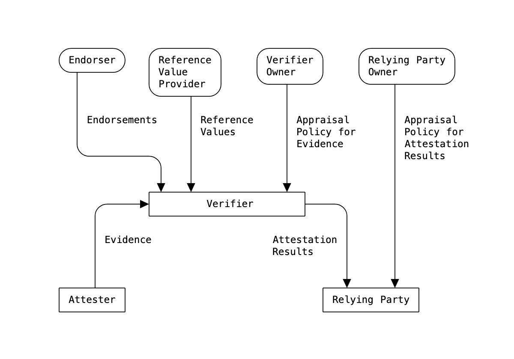
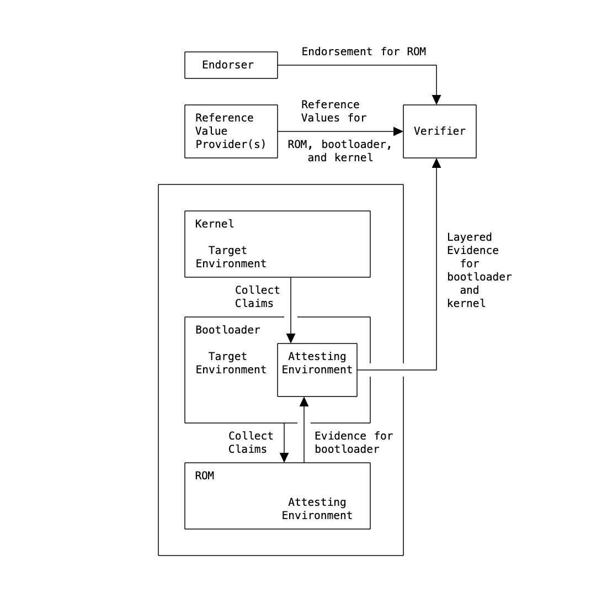

## Introduction

The question of how one system can know that another system can be trusted has found new interest and relevance in a world where trusted computing elements are maturing in processor architectures.

Systems that have been attested and verified to be in a good state (for some value of "good") can improve overall system posture. Conversely, systems that cannot be attested and verified to be in a good state can be given reduced access or privileges, taken out of service, or otherwise flagged for repair.

For example:

- A bank backend system might refuse to transact with another system that is not known to be in a good state.
- A healthcare system might refuse to transmit electronic healthcare records to a system that is not known to be in a good state.

In Remote Attestation Procedures (RATS), one peer (the "Attester") produces believable information about itself - Evidence - to enable a remote peer (the "Relying Party") to decide whether to consider that Attester a trustworthy peer or not. RATS are facilitated by an additional vital party, the Verifier.

The Verifier appraises Evidence via appraisal policies and creates the Attestation Results to support Relying Parties in their decision process.

## Architectural Overview

> Figure 1 depicts the data that flows between different roles, independent of protocol or use case.

The Attester role is assigned to entities that create Evidence that is conveyed to a Verifier.

The Verifier role is assigned to entities that use the Evidence, any Reference Values from Reference Value Providers, and any Endorsements from Endorsers, by applying an Appraisal Policy for Evidence to assess the trustworthiness of the Attester. This procedure is called the appraisal of Evidence.

Subsequently, the Verifier role generates Attestation Results for use by Relying Parties.

The Appraisal Policy for Evidence might be obtained from the Verifier Owner via some protocol mechanism, or might be configured into the Verifier by the Verifier Owner, or might be programmed into the Verifier, or might be obtained via some other mechanism.

The Relying Party role is assigned to an entity that uses Attestation Results by applying its own appraisal policy to make application-specific decisions, such as authorization decisions. This procedure is called the appraisal of Attestation Results.

The Appraisal Policy for Attestation Results might be obtained from the Relying Party Owner via some protocol mechanism, or might be configured into the Relying Party by the Relying Party Owner, or might be programmed into the Relying Party, or might be obtained via some other mechanism.

## Layered Attestation Environments

An Attester may consist of one or more nested environments (layers). The bottom layer of an Attester has an Attesting Environment that is typically designed to be immutable or difficult to modify by malicious code. In order to appraise Evidence generated by an Attester, the Verifier needs to trust various layers, including the bottom Attesting Environment. Trust in the Attester's layers, including the bottom layer.

In layered attestation, Claims can be collected from or about each layer beginning with an initial layer. The corresponding Claims can be structured in a nested fashion that reflects the nesting of the Attester's layers. Normally, Claims are not self-asserted, rather a previous layer acts as the Attesting Environment for the next layer. Claims about an initial layer typically are asserted by an Endorser.

> The example device illustrated in Figure 2 includes (A) a BIOS stored in read-only memory, (B) a bootloader, and (C) an operating system kernel.

The first Attesting Environment, the ROM in this example, has to ensure the integrity of the bootloader (the first Target Environment).Claims relating to the integrity of the bootloader have to be measured securely.

After the boot sequence is started, the BIOS conducts the most important and defining feature of layered attestation, which is that the successfully measured bootloader now becomes (or contains) an Attesting Environment for the next layer. This procedure in layered attestation is sometimes called "staging".

It is important that the bootloader not be able to alter any Claims about itself that were collected by the BIOS. This can be ensured having those Claims be either signed by the BIOS or stored in a tamper-proof manner by the BIOS.

Continuing with this example, the bootloader's Attesting Environment is now in charge of collecting Claims about the next Target Environment, which in this example is the kernel to be booted. The final Evidence thus contains two sets of Claims:

- one set about the bootloader as measured and signed by the BIOS,
- a set of Claims about the kernel as measured and signed by the bootloader.

This example could be extended further by making the kernel become another Attesting Environment for an application as another Target Environment. This would result in a third set of Claims in the Evidence pertaining to that application.

The essence of this example is a cascade of staged environments. Each environment has the responsibility of measuring the next environment before the next environment is started.

In general, the number of layers may vary by device or implementation, and an Attesting Environment might even have multiple Target Environments that it measures, rather than only one as shown by example in Figure 2.

---

 

To be continued in the next blog post

 

---

 
References

- [Remote Attestation Procedures Architecture](https://www.ietf.org/archive/id/draft-ietf-rats-architecture-22.html#I-D.ietf-teep-architecture)
